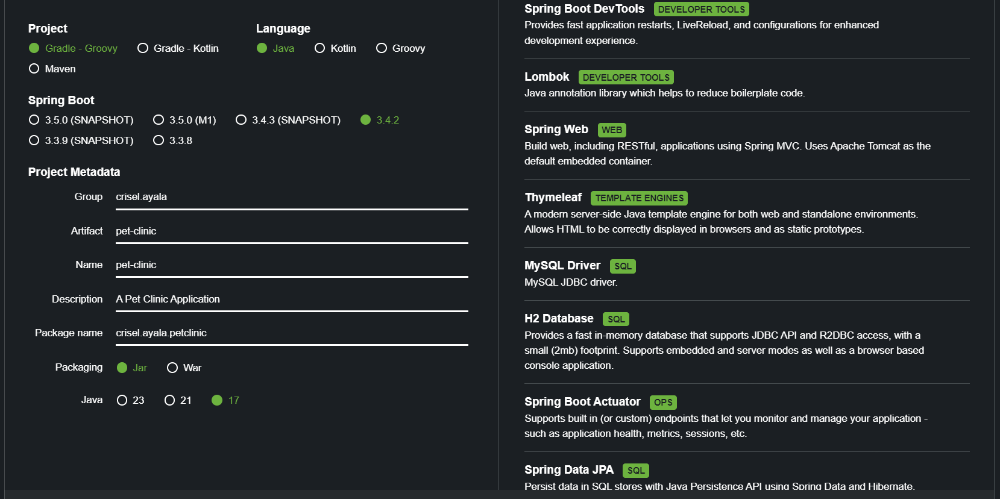

# pet-clinic
My version of Spring Pet Clinic application.

## initializing

1. Create Repository
2. Create Spring App
    2.1. With [Spring Initializr](https://start.spring.io)
        - Advice: Naming the package as the java name convention
        - what I set:
        